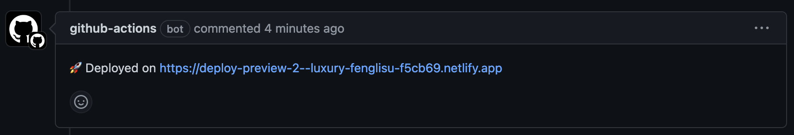

## demo repo to demonstrate pull request preview deploys

**Steps**

1. Netlify
	- Login https://app.netlify.com/
	- Add new site
	- Import an existing project
	- Deploy with GitHub
	- Find project, Click Deploy project
	- Go to Site Configuration > Build & Deploy
		- Under Repository, unlink the repository so it's only hosting deploys you push to it from GitHub
	- Get a Netlify auth token
		- User settings > Applications > Personal access tokens > New access token
			- Give a description
			- Set expiration
			- Make sure to save your token somewhere you won't lose it
			- Set a reminder to rotate token if you didn't choose no expiration date

2. In your GitHub repository
	- Add the token as an env var as `NETLIFY_AUTH_TOKEN` to your repo
		- Settings > Secrets and variables > Repository secrets, then click New repository secret. Set the name as `NETLIFY_AUTH_TOKEN` and the value as the token you just generated at Netlify
	- Permissions changes
		- Go to Settings > Actions > General, then change Workflow permissions to **Read and write permissions**, so that workflows have read and write permissions in the repository for all scopes. 

3. Setup the workflow file
	- Add a gh actions yml file with contents from https://github.com/getwilds/getwilds.github.io/blob/buttons/.github/workflows/preview.yaml
		- set the NETLIFY_SITE_ID to the site id in the Configuration page of your Netlify app
	- push the gh action file

4. Do a PR
	- Make a change on a branch
	- Push to the repo
	- Open a pull request
	- After a little while you should see a ping back from Netlify! like this:
	

